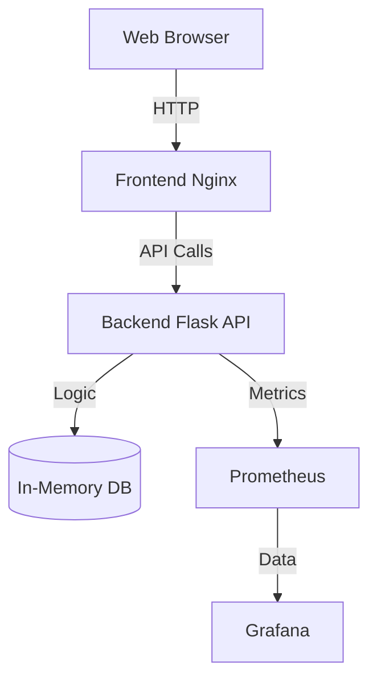

# Cloud-Native Task Manager

A complete DevOps portfolio project demonstrating a 3-tier application deployed with modern cloud-native practices.

## 🚀 Project Overview
This project is a simple Task Manager application built to showcase end-to-end DevOps skills, including:
- **Containerization**: Docker & Docker Compose
- **Orchestration**: Kubernetes (K8s)
- **Infrastructure as Code**: Terraform (AWS)
- **CI/CD**: GitHub Actions
- **Monitoring**: Prometheus & Grafana

## 🏗 Architecture


## 🛠 Tech Stack
- **Frontend**: HTML, CSS, JavaScript (Nginx)
- **Backend**: Python Flask
- **Infrastructure**: AWS EC2, Docker, Kubernetes
- **CI/CD**: GitHub Actions
- **IaC**: Terraform

## 🏃‍♂️ How to Run

### Local Development (Docker Compose)
```bash
docker-compose up --build
```
Access the frontend at `http://localhost:8080`.

### Kubernetes Deployment
```bash
kubectl apply -f k8s/
```

### Infrastructure Provisioning (AWS)
```bash
cd terraform/aws
terraform init
terraform apply
```

## 🤝 Contributing
See [CONTRIBUTING.md](CONTRIBUTING.md) for guidelines.
